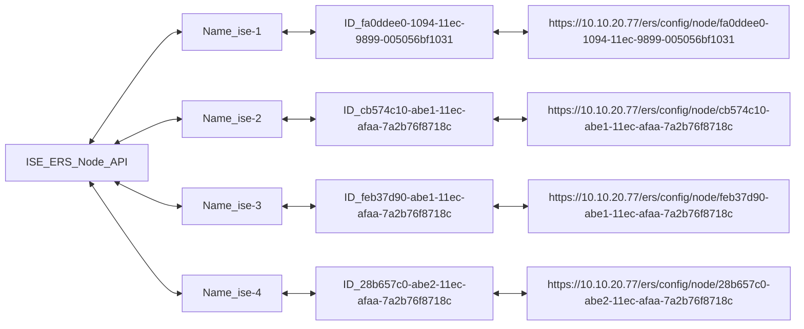

```mermaid
flowchart LR;
ISE_ERS_Node_API <--> Name_ise-1 <--> ID_fa0ddee0-1094-11ec-9899-005056bf1031 <--> https://10.10.20.77/ers/config/node/fa0ddee0-1094-11ec-9899-005056bf1031
ISE_ERS_Node_API <--> Name_ise-2 <--> ID_cb574c10-abe1-11ec-afaa-7a2b76f8718c <--> https://10.10.20.77/ers/config/node/cb574c10-abe1-11ec-afaa-7a2b76f8718c
ISE_ERS_Node_API <--> Name_ise-3 <--> ID_feb37d90-abe1-11ec-afaa-7a2b76f8718c <--> https://10.10.20.77/ers/config/node/feb37d90-abe1-11ec-afaa-7a2b76f8718c
ISE_ERS_Node_API <--> Name_ise-4 <--> ID_28b657c0-abe2-11ec-afaa-7a2b76f8718c <--> https://10.10.20.77/ers/config/node/28b657c0-abe2-11ec-afaa-7a2b76f8718c
```