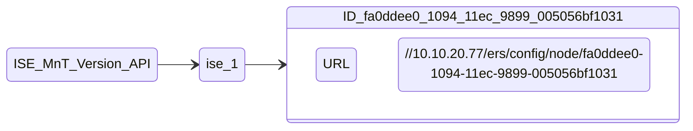
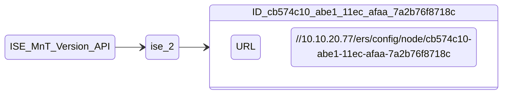
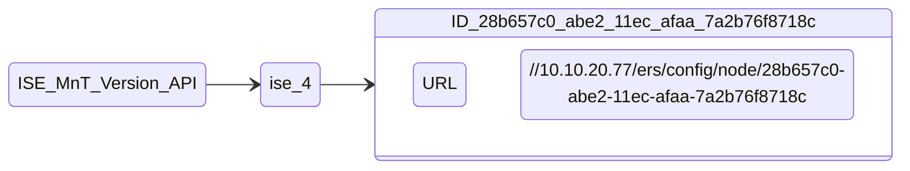

```mermaid
stateDiagram
    direction LR
ISE_MnT_Version_API --> ise_1
ise_1 --> ID_fa0ddee0_1094_11ec_9899_005056bf1031
state ID_fa0ddee0_1094_11ec_9899_005056bf1031{
        URL https://10.10.20.77/ers/config/node/fa0ddee0-1094-11ec-9899-005056bf1031
}
```

```mermaid
stateDiagram
    direction LR
ISE_MnT_Version_API --> ise_2
ise_2 --> ID_cb574c10_abe1_11ec_afaa_7a2b76f8718c
state ID_cb574c10_abe1_11ec_afaa_7a2b76f8718c{
        URL https://10.10.20.77/ers/config/node/cb574c10-abe1-11ec-afaa-7a2b76f8718c
}
```

```mermaid
stateDiagram
    direction LR
ISE_MnT_Version_API --> ise_3
ise_3 --> ID_feb37d90_abe1_11ec_afaa_7a2b76f8718c
state ID_feb37d90_abe1_11ec_afaa_7a2b76f8718c{
        URL https://10.10.20.77/ers/config/node/feb37d90-abe1-11ec-afaa-7a2b76f8718c
}
```

```mermaid
stateDiagram
    direction LR
ISE_MnT_Version_API --> ise_4
ise_4 --> ID_28b657c0_abe2_11ec_afaa_7a2b76f8718c
state ID_28b657c0_abe2_11ec_afaa_7a2b76f8718c{
        URL https://10.10.20.77/ers/config/node/28b657c0-abe2-11ec-afaa-7a2b76f8718c
}
```